# Backend Setup for ZAINA COLLECTION

This document provides a step-by-step guide to building a robust backend for the ZAINA COLLECTION e-commerce website. It outlines the recommended technology stack, project structure, database models, and API endpoints required to support the frontend application.

## 1. Recommended Technology Stack

For a modern, scalable, and maintainable e-commerce backend, we recommend the following technologies:

-   **Runtime Environment:** [Node.js](https://nodejs.org/) (LTS version)
-   **Framework:** [Express.js](https://expressjs.com/)
-   **Database:** [MongoDB](https://www.mongodb.com/) (for flexible, scalable document storage).
-   **ODM (Object-Document Mapper):** [Prisma](https://www.prisma.io/) (for type-safe database access)
-   **Authentication:** [JSON Web Tokens (JWT)](https://jwt.io/)
-   **Media Storage:** [AWS S3](https://aws.amazon.com/s3/) or Google Cloud Storage (for scalable image and video hosting)
-   **Payment Gateway:** [Razorpay](https://razorpay.com/) (as it's already integrated in the frontend)
-   **Language:** [TypeScript](https://www.typescriptlang.org/)

## 2. Setup and Running

Follow these steps precisely to get the backend server running.

**Step 1: Install Dependencies**
Navigate to the `backend` directory in your terminal.
```bash
cd backend
npm install
```

**Step 2: Set Up Environment Variables**
In the `backend` directory, create a `.env` file. Copy the contents from the example below and fill in your actual credentials.

```env
# .env

# Database: Replace with your MongoDB connection string from MongoDB Atlas
DATABASE_URL="mongodb+srv://<USER>:<PASSWORD>@<CLUSTER>/<DATABASE_NAME>?retryWrites=true&w=majority"

# JWT
JWT_SECRET="YOUR_SUPER_SECRET_JWT_KEY"
JWT_EXPIRES_IN="7d"

# Server
PORT=5000

# Razorpay
RAZORPAY_KEY_ID="YOUR_RAZORPAY_KEY_ID"
RAZORPAY_KEY_SECRET="YOUR_RAZORPAY_KEY_SECRET"

# AWS S3 for Media Storage
AWS_ACCESS_KEY_ID="YOUR_AWS_ACCESS_KEY"
AWS_SECRET_ACCESS_KEY="YOUR_AWS_SECRET_KEY"
AWS_S3_BUCKET_NAME="your-s3-bucket-name"
AWS_S3_REGION="your-s3-bucket-region"
```

**Step 3: Generate Prisma Client**
This is a **crucial** step. It generates the type-safe database client based on your schema. Run this after `npm install` and any time you change `schema.prisma`.
```bash
npx prisma generate
```

**Step 4: Run the Server**
This command starts the backend server in development mode. It will automatically restart when you make code changes.
```bash
npm run dev
```
You should see `[server]: Server is running at http://localhost:5000`. **You must keep this terminal window open while using the frontend application.**

## 3. Data Structure & Database Schema (Prisma)

The data structure is defined in `backend/prisma/schema.prisma` and is based directly on your frontend's `types.ts` file. This ensures consistency between the frontend and backend.

### 3.1. Database Flow Diagram (ERD)

The following diagram illustrates the relationships between the major entities in the database.


## 4. API Endpoints

The backend exposes the following REST API endpoints. All routes are prefixed with `/api`.

#### Authentication (`/auth`)
-   `POST /register`: Create a new user account.
-   `POST /login`: Log in a user and return a JWT.

#### Products (`/products`) - *Public*
-   `GET /`: Get a list of all published products.
-   `GET /:slug`: Get details for a single product by its slug.

#### Cart (`/cart`) - *Protected Route (requires JWT)*
-   `GET /`: Get the current user's cart items.
-   `POST /`: Add an item to the cart.
-   `PUT /:variantId`: Update quantity of an item in the cart.
-   `DELETE /:variantId`: Remove an item from the cart.

#### Orders (`/orders`) - *Protected Route*
-   `POST /payment/create`: Create a Razorpay order ID.
-   `POST /`: Create a new order.

#### User Profile (`/user`) - *Protected Route*
-   `GET /profile`, `PUT /profile`: Manage user profile.
-   `GET /addresses`, `POST /addresses`, `PUT /addresses/:id`, `DELETE /addresses/:id`: Full CRUD for user addresses.
-   `GET /orders`: Get the user's order history.

#### Media (`/media`) - *Protected Route*
-   `GET /presigned-url`: Get a secure URL to upload a file to AWS S3.

#### Admin Panel (`/admin`) - *Admin Protected Routes*
-   `POST /products`, `PUT /products/:id`, `DELETE /products/:id`: Manage products.
-   `GET /orders`, `PUT /orders/:id/status`: Manage orders.

## 5. User Flow Diagram

This diagram illustrates the primary paths a user can take through the application.

```mermaid
graph TD
    subgraph "Browsing & Shopping"
        A[Homepage] --> B(Shop Page);
        A --> C{Product Detail};
        B --> C;
        C --> D[Add to Cart];
        D --> E(Cart Page);
    end

    subgraph "Authentication & Checkout"
        E --> F{Auth Wall};
        F -- Login/Register --> G[Authenticated Session];
        G --> H(Checkout Page);
        H --> I[Payment Process];
        I --> J(✅ Order Success);
    end

    subgraph "User Dashboards"
        G --> K{Role Check};
        K -- User Role --> L[User Dashboard];
        K -- Admin Role --> M[Admin Dashboard];
    end
```



## 6. Authentication & Security

1.  **Password Hashing:** Passwords are never stored in plain text. We use `bcryptjs` to hash and salt passwords.
2.  **JSON Web Tokens (JWT):** When a user logs in, the server issues a signed JWT. This token must be sent in the `Authorization` header for protected requests.
3.  **Middleware Protection:**
    -   `isAuthenticated`: Middleware that checks for a valid JWT.
    -   `isAdmin`: Middleware that checks if the authenticated user has the 'ADMIN' role.
4.  **Environment Variables:** All secrets are stored in a `.env` file, which is kept out of version control.

## 7. Media (Image/Video) Handling

We use a **pre-signed URL** strategy with AWS S3 for scalable uploads:
1.  The frontend requests a secure upload URL from the backend.
2.  The backend generates a temporary URL using the AWS SDK that grants permission to upload directly to your S3 bucket. This keeps heavy traffic off our server.
3.  The frontend uploads the file straight to S3.
4.  The final URL of the uploaded file is then stored in our database.

## 8. Full Prisma Schema (`schema.prisma`)

The single source of truth for the database schema is located at `backend/prisma/schema.prisma`. This file defines all data models, relations, and database-specific configurations for the ZAINA project.

```prisma
// This is your Prisma schema file,
// learn more about it in the docs: https://pris.ly/d/prisma-schema

generator client {
  provider = "prisma-client-js"
}

datasource db {
  provider = "mongodb"
  url      = env("DATABASE_URL")
}

// USER AND AUTH MODELS
model User {
  id                      String    @id @default(auto()) @map("_id") @db.ObjectId
  name                    String
  email                   String    @unique
  password                String
  role                    String    @default("USER") // USER or ADMIN
  phone                   String?
  dateOfBirth             DateTime?
  profilePictureUrl       String?
  joinDate                DateTime  @default(now())
  wishlistProductIds      String[]  @db.ObjectId
  recentlyViewedProductIds String[]  @db.ObjectId
  isActive                Boolean   @default(true) // For admin users
  isBlocked               Boolean   @default(false) // For customers
  lastLogin               DateTime?

  addresses       Address[]
  orders          Order[]
  supportTickets  SupportTicket[]
  paymentMethods  PaymentMethod[]
  reviews         ProductReview[]
  cart            Cart?
  chatSessions    ChatSession[]

  @@map("users")
}


model Address {
  id           String  @id @default(auto()) @map("_id") @db.ObjectId
  userId       String  @db.ObjectId
  type         String // "shipping" or "billing"
  fullName     String
  addressLine1 String
  addressLine2 String?
  city         String
  state        String
  postalCode   String
  country      String
  phone        String?
  isDefault    Boolean @default(false)

  user User @relation(fields: [userId], references: [id], onDelete: Cascade)

  @@map("addresses")
}

model PaymentMethod {
  id          String  @id @default(auto()) @map("_id") @db.ObjectId
  userId      String  @db.ObjectId
  type        String // "card", "cod", "razorpay"
  last4       String
  expiryMonth String
  expiryYear  String
  brand       String
  isDefault   Boolean @default(false)

  user User @relation(fields: [userId], references: [id], onDelete: Cascade)

  @@map("payment_methods")
}

// PRODUCT AND E-COMMERCE MODELS
model Product {
  id                  String   @id @default(auto()) @map("_id") @db.ObjectId
  name                String
  slug                String   @unique
  price               Float // Base selling price
  mrp                 Float // Max retail price
  imageUrl            String?
  images              String[]
  hoverImageUrl       String?
  isNew               Boolean  @default(false)
  isBestSeller        Boolean  @default(false)
  rating              Float?
  description         String
  tags                String[]
  occasion            String?
  emotion             String?
  sku                 String?  @unique
  stockQuantity       Int?     // Base stock, for simple products
  brand               String?
  gender              String?  // "Male", "Female", "Unisex"
  isTaxable           Boolean  @default(true)
  specifications      Json?    // [{ "key": "Fabric", "value": "Cotton" }]
  vendor              String?
  metaTitle           String?
  metaDescription     String?
  publishStatus       String   @default("Draft") // "Draft", "Published", "Hidden"
  longDescriptionHtml String?
  bannerImageUrl      String?
  bannerLink          String?
  faqs                Json?    // [{ "question": "...", "answer": "..." }]
  categoryName        String
  subCategoryName     String?

  // New shipping fields
  weightKg          Float?
  dimensionsCm      Json?    // { "length": 10, "width": 10, "height": 10 }

  variants ProductVariant[]
  reviews  ProductReview[]
  orderItems OrderItem[]
  cartItems CartItem[]

  @@map("products")
}

model ProductVariant {
  id            String @id @default(auto()) @map("_id") @db.ObjectId
  productId     String @db.ObjectId
  attributes    Json   // { "Color": "Red", "Size": "M" }
  price         Float
  stockQuantity Int
  sku           String @unique
  imageUrl      String?

  product    Product     @relation(fields: [productId], references: [id], onDelete: Cascade)
  orderItems OrderItem[]
  cartItems  CartItem[]

  @@map("product_variants")
}

model Category {
  id              String     @id @default(auto()) @map("_id") @db.ObjectId
  name            String     @unique
  parentId        String?    @db.ObjectId
  
  parent          Category?    @relation("SubCategories", fields: [parentId], references: [id], onDelete: NoAction, onUpdate: NoAction)
  subCategories   Category[]   @relation("SubCategories")

  @@map("categories")
}

model VariantAttribute {
  id     String   @id @default(auto()) @map("_id") @db.ObjectId
  name   String   @unique // e.g., "Size", "Color"
  values String[]

  @@map("variant_attributes")
}

model Coupon {
  id          String   @id @default(auto()) @map("_id") @db.ObjectId
  code        String   @unique
  type        String   // "percentage", "fixed_amount", "bogo"
  value       Float
  description String?
  startDate   DateTime?
  endDate     DateTime?
  usageLimit  Int?
  usageCount  Int?     @default(0)
  isActive    Boolean  @default(true)
  rules       String?

  @@map("coupons")
}

model ProductReview {
  id        String   @id @default(auto()) @map("_id") @db.ObjectId
  userId    String   @db.ObjectId
  productId String   @db.ObjectId
  rating    Int
  comment   String
  createdAt DateTime @default(now())
  approved  Boolean  @default(false)

  user    User    @relation(fields: [userId], references: [id], onDelete: Cascade)
  product Product @relation(fields: [productId], references: [id], onDelete: Cascade)

  @@map("product_reviews")
}


// CART AND ORDER MODELS
model Cart {
  id     String @id @default(auto()) @map("_id") @db.ObjectId
  userId String @unique @db.ObjectId
  
  user  User       @relation(fields: [userId], references: [id], onDelete: Cascade)
  items CartItem[]

  @@map("carts")
}

model CartItem {
  id        String @id @default(auto()) @map("_id") @db.ObjectId
  cartId    String @db.ObjectId
  productId String @db.ObjectId
  variantId String @db.ObjectId
  quantity  Int

  cart    Cart           @relation(fields: [cartId], references: [id], onDelete: Cascade)
  product Product        @relation(fields: [productId], references: [id], onDelete: Cascade)
  variant ProductVariant @relation(fields: [variantId], references: [id], onDelete: Cascade)

  @@map("cart_items")
}

model Order {
  id                String      @id @default(auto()) @map("_id") @db.ObjectId
  userId            String?     @db.ObjectId // Optional for guest checkouts
  orderDate         DateTime    @default(now())
  customerName      String
  totalAmount       Float
  status            String      // "Pending", "Processing", "Shipped", "Delivered", "Cancelled"
  shippingAddress   Json
  trackingNumber    String?
  paymentType       String?
  deliveryType      String?
  deliveryCharge    Float?
  appliedCouponCode String?
  discountAmount    Float?
  transactionId     String?
  paymentStatus     String?     // "Success", "Failed", "Pending"

  user  User?       @relation(fields: [userId], references: [id])
  items OrderItem[]

  @@map("orders")
}

model OrderItem {
  id              String         @id @default(auto()) @map("_id") @db.ObjectId
  orderId         String         @db.ObjectId
  productId       String         @db.ObjectId
  variantId       String         @db.ObjectId
  quantity        Int
  priceAtPurchase Float
  variantSnapshot Json

  order   Order          @relation(fields: [orderId], references: [id], onDelete: Cascade)
  product Product        @relation(fields: [productId], references: [id], onDelete: NoAction, onUpdate: NoAction)
  variant ProductVariant @relation(fields: [variantId], references: [id], onDelete: NoAction, onUpdate: NoAction)

  @@map("order_items")
}

// SUPPORT AND LOGGING
model SupportTicket {
  id          String   @id @default(auto()) @map("_id") @db.ObjectId
  userId      String   @db.ObjectId
  subject     String
  status      String   // "Open", "In Progress", "Resolved", "Closed"
  lastUpdated DateTime @updatedAt
  createdAt   DateTime @default(now())
  messages    Json[]   // [{ sender, text, timestamp }]
  assignedTo  String?
  seenByAdmin Boolean  @default(false)

  user User @relation(fields: [userId], references: [id], onDelete: Cascade)

  @@map("support_tickets")
}

model AdminActivityLog {
  id            String   @id @default(auto()) @map("_id") @db.ObjectId
  timestamp     DateTime @default(now())
  adminUserId   String   @db.ObjectId
  adminUserName String
  action        String
  ipAddress     String?
  details       String?

  @@map("admin_activity_logs")
}

model ActivityLog {
    id        String @id @default(auto()) @map("_id") @db.ObjectId
    message   String
    timestamp DateTime @default(now())

    @@map("activity_logs")
}

model MediaFile {
  id        String   @id @default(auto()) @map("_id") @db.ObjectId
  name      String
  url       String
  size      Int
  type      String   // "image" or "video"
  createdAt DateTime @default(now())

  @@map("media_files")
}

// DYNAMIC CONTENT AND CMS
model HeroSlide {
  id          String  @id @default(auto()) @map("_id") @db.ObjectId
  imageUrl    String
  device      String  // "desktop" or "mobile"
  supertitle  String?
  title       String?
  titleColor  String?
  offerText   String?
  subtitle    String?
  buttons     Json[]  // [{ text, link }]
  order       Int
  isActive    Boolean @default(true)

  @@map("hero_slides")
}

model ShoppableVideo {
    id                 String   @id @default(auto()) @map("_id") @db.ObjectId
    videoUrl           String
    thumbnailUrl       String
    title              String
    tag                String?
    featuredProductIds String[] @db.ObjectId

    @@map("shoppable_videos")
}

model Testimonial {
  id              String  @id @default(auto()) @map("_id") @db.ObjectId
  userImage       String
  userName        String
  userHandle      String?
  quote           String
  productImageUrl String?
  rating          Int?
  approved        Boolean @default(false)

  @@map("testimonials")
}

model OccasionContent {
  id          String @id @default(auto()) @map("_id") @db.ObjectId
  name        String @unique
  title       String
  description String
  imageUrl    String

  @@map("occasion_content")
}

model CuratedLook {
    id             String   @id @default(auto()) @map("_id") @db.ObjectId
    title          String
    imageUrl       String
    productIds     String[] @db.ObjectId
    description    String

    @@map("curated_looks")
}

model EmotionCategory {
    id          String @id @default(auto()) @map("_id") @db.ObjectId
    name        String @unique
    emotionTag  String @unique
    imageUrl    String
    description String

    @@map("emotion_categories")
}

model CmsPage {
  id               String   @id @default(auto()) @map("_id") @db.ObjectId
  type             String   // "page" or "post"
  title            String
  slug             String   @unique
  content          String
  metaTitle        String?
  metaDescription  String?
  status           String   // "Published", "Draft"
  lastUpdated      DateTime @updatedAt
  lastUpdatedBy    String
  featuredImageUrl String?

  @@map("cms_pages")
}

model FloatingInfo {
    id              String @id @default(auto()) @map("_id") @db.ObjectId
    corner          String // "topLeft", "topRight", "bottomLeft", "bottomRight"
    text            String
    triggerSectionId String?

    @@map("floating_info")
}

model FashionGalleryImage {
    id          String @id @default(auto()) @map("_id") @db.ObjectId
    imageUrl    String
    order       Int
    isActive    Boolean @default(true)
    
    @@map("fashion_gallery_images")
}

model GuidedDiscoveryPath {
    id            String @id @default(auto()) @map("_id") @db.ObjectId
    prompt        String
    targetFilters Json
    
    @@map("guided_discovery_paths")
}


// SITE SETTINGS AND CONFIGURATION
model SiteSettings {
  id                      String @id @default(auto()) @map("_id") @db.ObjectId
  singleton               String @unique @default("global_settings")
  storeSettings           Json
  seoSettings             Json
  themeSettings           Json
  headerLinks             Json[]
  footerSettings          Json
  integrations            Json
  categoryGridItems       Json[]
  topCategories           Json[]
  promoGridItems          Json[]
  authPageSettings        Json?
  deliveryReturnsHtml     String?
  productDeclarationHtml  String?
  helpContactHtml         String?
  sizeGuideHtml           String?

  @@map("site_settings")
}

model HomepageLayout {
  id      String @id @default(auto()) @map("_id") @db.ObjectId
  name    String @unique
  layout  Json[]

  @@map("homepage_layouts")
}

model Integration {
    id          String @id @default(auto()) @map("_id") @db.ObjectId
    name        String @unique // "Facebook Pixel", "Razorpay", etc.
    category    String // "Marketing", "Payments", "Shipping"
    enabled     Boolean
    settings    Json

    @@map("integrations")
}

model Faq {
    id       String  @id @default(auto()) @map("_id") @db.ObjectId
    question String
    answer   String
    order    Int
    isActive Boolean @default(true)

    @@map("faqs")
}

model PaymentGateway {
    id       String  @id @default(auto()) @map("_id") @db.ObjectId
    name     String  @unique
    enabled  Boolean
    settings Json // Example for Razorpay: { "apiKey": "...", "apiSecret": "..." }. Example for PhonePe: { "merchantId": "...", "saltKey": "..." }

    @@map("payment_gateways")
}

model ShippingProvider {
    id        String  @id @default(auto()) @map("_id") @db.ObjectId
    name      String  @unique
    apiKey    String?
    apiSecret String?
    enabled   Boolean

    @@map("shipping_providers")
}

model ShippingZone {
    id        String         @id @default(auto()) @map("_id") @db.ObjectId
    name      String
    countries String[]
    states    String[]
    postcodes String[]
    rates     ShippingRate[]

    @@map("shipping_zones")
}

model ShippingRate {
    id             String  @id @default(auto()) @map("_id") @db.ObjectId
    shippingZoneId String  @db.ObjectId
    name           String
    price          Float
    condition      String? // "min_order_value", "weight_based"
    conditionValue Float?

    zone ShippingZone @relation(fields: [shippingZoneId], references: [id], onDelete: Cascade)

    @@map("shipping_rates")
}

model MarketingCampaign {
    id         String   @id @default(auto()) @map("_id") @db.ObjectId
    name       String
    type       String   // "email", "push"
    subject    String?
    content    String
    status     String   // "Draft", "Sent", "Active"
    sentAt     DateTime?
    recipients Int?

    @@map("marketing_campaigns")
}

model ChatSession {
    id          String @id @default(auto()) @map("_id") @db.ObjectId
    userId      String @unique @db.ObjectId
    createdAt   DateTime @default(now())
    lastUpdated DateTime @updatedAt
    
    user     User @relation(fields: [userId], references: [id], onDelete: Cascade)
    messages ChatMessage[]

    @@map("chat_sessions")
}

model ChatMessage {
    id             String @id @default(auto()) @map("_id") @db.ObjectId
    sessionId      String @db.ObjectId
    sender         String // "user" or "admin"
    text           String?
    attachmentUrl  String?
    attachmentType String? // "image" or "file"
    timestamp      DateTime @default(now())

    session ChatSession @relation(fields: [sessionId], references: [id], onDelete: Cascade)

    @@map("chat_messages")
}

// HOMEPAGE EDITOR COMPONENTS
model TeamMember {
    id       String @id @default(auto()) @map("_id") @db.ObjectId
    name     String
    title    String
    imageUrl String
    socials  Json   // { twitter, linkedin }
    order    Int?

    @@map("team_members")
}

model StatItem {
    id    String @id @default(auto()) @map("_id") @db.ObjectId
    icon  String
    value Int
    label String
    order Int?

    @@map("stat_items")
}

model PricingPlan {
    id          String   @id @default(auto()) @map("_id") @db.ObjectId
    name        String
    price       String
    frequency   String
    features    String[]
    isFeatured  Boolean
    buttonText  String
    buttonLink  String
    order       Int?
    
    @@map("pricing_plans")
}
```

## 5. Troubleshooting

### Problem: "Network Error" or "Failed to Fetch" on Frontend
This is the most common issue. **99% of the time, it means the backend server is not running or not reachable from your browser.**

**1. Is the Server Running?**
   - Look at the terminal where you ran `npm run dev`. Does it say `[server]: Server is running at http://localhost:5000`?
   - If it shows an error, there is likely a problem with your `.env` file (e.g., wrong database URL) or a code error. Read the terminal output carefully.
   - **Remember:** The backend server must be running in its own terminal for the frontend to talk to it.

**2. Can you reach the server directly?**
   - Open a **new** terminal window (while the server is still running).
   - Run the following command:
     ```bash
     curl http://localhost:5000/api/products
     ```
   - **If you see a JSON response (even an empty one):** The backend is working correctly! The problem is likely a browser issue (like a misbehaving extension) or a CORS problem if you changed the default settings.
   - **If you see `curl: (7) Failed to connect to localhost port 5000: Connection refused`:** This confirms your backend server is **NOT** running or is blocked by a firewall. Go back to Step 1.
